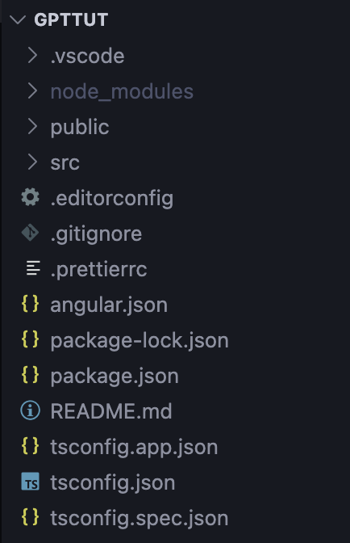

# <center>INTRODUCTION

### ANGULAR ?   
Released in **2010 (AngularJS)** by Google  
Created by **Misko Hevery and Adam Abrons**  
Originally called **AngularJS (Deprecated)**, currently **Angular (2+)**.

> ⚠️ AngularJS and Angular (2+) are different frameworks.

---
### AngularJS Architecture → MVC
1. **MODEL**  
Data + Business Logic — what data we have and how we handle it.

2. **VIEW**  
UI — the screen the user sees.

3. **CONTROLLER**  
Middleman — connects View ↔ Model.

### Angular (2+) Architecture → Component-Based
Angular (2+) does **not** use MVC or Controllers.  
It uses **Components + Services + Dependency Injection**.

---
### INSTALLATION ?

Go to https://angular.dev/installation  

Install Angular CLI (@angular/cli) once using  
`npm i -g @angular/cli`  -g means global

Verify using 
`ng version`

---
### For Every New Project:-
Go to that folder  
`ng new <ProjectName>`  
`cd <ProjectName>`  
`ng serve`  To run server  
It will run on 
 http://localhost:4200/  

TO SEE ALL ng commands `ng help`  

---
## ANGULAR CLI
> Command Line Interface for Angular.

Tool that helps developers  
Create, build, test, and deploy angular applications.  

---
**WHY WE NEED IT ?**  
Angular projects have:
- Strict structure
- Multiple config files
- TypeScript setup
- Build configuration
- CLI automates all that.

Without CLI → setup would take 1–2 hours manually.  
With CLI → 1 command.

      Angular → PORT:4200

---
### FILE & FOLDER STRUCTURE :-  

Root Level :-



- .vscode : VS Code settings for this project only.  
- node_modules : All installed dependencies.
- public : Static assets.
- src: Inside src:
    - main.ts → Entry point (bootstraps Angular app)
    - index.html → Main HTML file
    - styles.css → Global styles
    - app → Your real application code
- .editorconfig : Controls indentation rules
- .prettierrc : Formatting rules (Prettier).
- angular.json : Angular project configuration.
- package.json : Project metadata, scripts, and dependencies.
- tsconfig.app.json : TypeScript config specifically for app files.
- tsconfig.json : TypeScript configuration. 
- tsconfig.spec.json : TypeScript config for test files.             

---
# <center>TYPES

### STYLE 1: MODULE-BASED
(Angular 2 → Angular 14)
> Every app has one main container called a Module,    
app.module.ts

```
AppModule
 ├── Component A
 ├── Component B
 ├── FormsModule
 ├── HttpClientModule
```

```ts
// app.module.ts
import { FormsModule } from '@angular/forms';

@NgModule({
  declarations: [AppComponent],
  imports: [FormsModule],
})
export class AppModule {}
```
👉 Once imported here, all components can use ngModel.

---
### STYLE 2: STANDALONE COMPONENTS (MODERN)
From Angular 14+

```
Component
 ├── HTML
 ├── CSS
 ├── TypeScript
 ├── FormsModule (if needed)
```

```ts
// component.ts
import { Component } from '@angular/core';
import { FormsModule } from '@angular/forms';

@Component({
  selector: 'app-root',
  standalone: true,
  imports: [FormsModule],
  templateUrl: './app.component.html'
})
export class AppComponent {
  firstName = '';
}
```