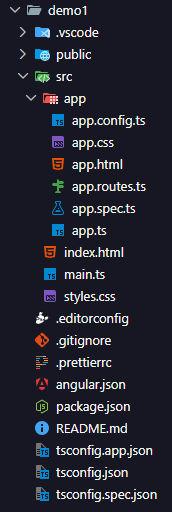

# 
INTRODUCTION

### ANGULAR ?   
Released in **2010 (AngularJS)** by Google  
Created by **Misko Hevery and Adam Abrons**  
Originally called **AngularJS (Deprecated)**, currently **Angular (2+)**.

> ⚠️ AngularJS and Angular (2+) are different frameworks.

- Angular is not just a UI library like React. It is a full‑fledged framework.  
- Angular gives a complete, opinionated structure for large-scale applications, unlike libraries where we assemble everything ourselves.

---
### AngularJS(1.x) (Old)  Architecture : MVC
1. **MODEL**  
Data + Business Logic — what data we have, how we handle it.

2. **VIEW**  
UI — The screen user sees.

3. **CONTROLLER**  
Middleman — connects View ↔ Model.

### Angular (2+) Architecture : Component-Based  
It uses **Components + Services + Dependency Injection**.

---
### INSTALLATION ?

Go to https://angular.dev/installation  
Install Angular CLI (@angular/cli) once using  

    npm i -g @angular/cli  //-g means global

    ng version //to verify

---
### For Every New Project:-
Go to that folder  
`ng new <ProjectName>`  
`cd <ProjectName>`  
`ng serve`  To run server  
It will run on 
 http://localhost:4200/  

TO SEE ALL ng commands `ng help`  

---
## ANGULAR CLI
> Command Line Interface for Angular.

Tool that helps developers  
Create, build, test, and deploy angular applications.  

**WHY WE NEED IT ?**  
Angular projects have:
- Strict structure
- Multiple config files
- TypeScript setup
- Build configuration
- CLI automates all that.

Without CLI → setup would take 1–2 hours manually.  
With CLI → 1 command.

---
### FILE & FOLDER STRUCTURE :-  

Root Level :-

- .vscode : VS Code settings for this project only.  
- node_modules : All installed dependencies.
- public : Static assets.
- src: Inside src:
    - main.ts → Entry point (bootstraps Angular app)
    - index.html → Main HTML file
    - styles.css → Global styles
    - app → Your real application code
- .editorconfig : Controls indentation rules
- .prettierrc : Formatting rules (Prettier).
- angular.json : Angular project configuration.
- package.json : Project metadata, scripts, and dependencies.
- tsconfig.app.json : TypeScript config specifically for app files.
- tsconfig.json : TypeScript configuration. 
- tsconfig.spec.json : TypeScript config for test files.             

---

# 
 SPA vs MPA
How MPA works

1. User clicks a link
2. Browser sends a request to the server
3. Server returns a new HTML page
4. Browser reloads the entire page

Each page = separate HTML file  
Full page reload every time

SPA :-  
The browser loads only ONE HTML file  
Then JavaScript updates the screen dynamically  
In Angular (SPA):

URL change = Angular decides which component to show
That’s why Angular has:
Router,
router-outlet,
Route configuration
>  Routing is component switching

---
# 
 BOOTSTRAPPING

Bootstrapping means: How Angular app starts running in the browser

    http://localhost:4200
            |           
            v
       index.html
            |
            v
    <app-root></app-root>
    // At first: <app-root> is empty  
    Browser does NOT know what it is
            |
            v
         main.ts
            |
            v
    bootstrapApplication(AppComponent)
    //Angular, start my app using AppComponent