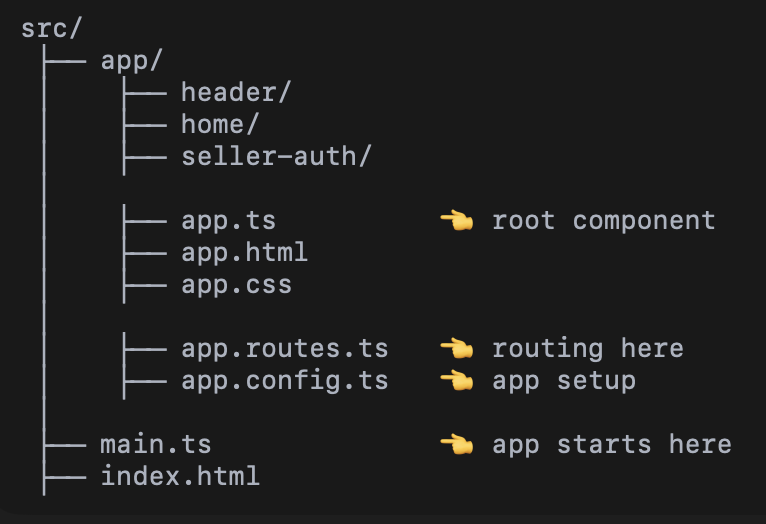
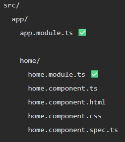

## <center>Angular Project Types

#### 1. STANDALONE :-


❌ No app.module.ts  
✅ Has app.config.ts

---
#### 2. MODULE BASED :-


---

# <CENTER> Module ?

When Angular (older style) starts, main.ts loads `app.module.ts`  

A Module (NgModule) is a class that groups related components,
directives, pipes, and services into a single unit. It helps Angular organize and manage application features.


---

#### What Does Module Contain?
```ts
@NgModule({
  declarations: [],
  imports: [],
  providers: [], //Register services (DI), but now use @injectable
  exports: [],
  bootstrap: []
})
export class AppModule {}
```

Earlier Angular versions, By default created a Module‑based project Now Stand-Alone.  
Earlier we had `app.module.ts`

Let's say we want to use `*ngIf, *ngFor, ngModel`  
In Module‑Based Angular, You must:
1. Open app.module.ts
2. Import required modules, Add them to imports: []

```ts
//app.module.ts

@NgModule({ //first decorator @NgModule
  declarations: [
    AppComponent
  ],
  imports: [
    CommonModule,
    FormsModule   // 👈 needed for ngModel
  ],
  bootstrap: [AppComponent]
})
export class AppModule {}
```

---
## <center>In Standalone
```ts
// app.component.ts
@Component({
  selector: 'app-root',
  standalone: true, //Important line
  imports: [        //Imported directly
    CommonModule,
    FormsModule //added in exact file
  ],
  templateUrl: './app.component.html'
})
export class AppComponent {
  name = '';
}
```
