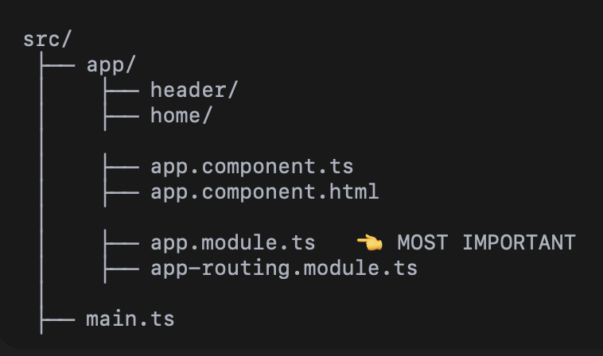

## Angular Modules (NgModules) ✅
*   What is a Module
*   `NgModule` Metadata
*   AppModule
*   Feature Modules
*   Core Module
*   Shared Module
*   Lazy Loaded Modules
*   When & Why Modules Exist

---


# <CENTER> Module
An Angular Module is:  
A container that groups related components, directives, pipes, and services.

If EVERYTHING lives in one place:  
❌ files become messy
❌ hard to maintain
❌ slow loading

---

#### What Does app.module.ts Contain?
1. @NgModule: Decorator
2. Declarations Box: Who belongs to me?  
Components, Directives, Pipes
3. Imports Box: To use features provided by the modules
4. Provider Box: Which services are available app‑wide?
5. Bootstrap Box: What starts first?
```ts
//app.module.ts

@NgModule({ 
  declarations: [ AppComponent ],
  imports: [ FormsModule, CommonModule ],
  providers: [],
  bootstrap: [AppComponent]
})
export class AppModule {}
```

---
## <center>Module-based vs Standalone

#### 1. STANDALONE :-


❌ No app.module.ts  
✅ Has app.config.ts

---
#### 2. MODULE BASED :-



---
Earlier Angular versions, By default created a Module‑based project Now Stand-Alone.


Earlier we had `app.module.ts`

Let's say we want to use `*ngIf, *ngFor, ngModel`  
In Module‑Based Angular, You must:

    Open app.module.ts
    Import required modules, Add them to imports: []

```ts
//app.module.ts

@NgModule({ //first decorator @NgModule
  declarations: [
    AppComponent
  ],
  imports: [
    BrowserModule,
    FormsModule   // 👈 needed for ngModel
  ],
  bootstrap: [AppComponent]
})
export class AppModule {}
```

```ts
// demo.component.ts
@Component({
  selector: 'app-root',
  templateUrl: './app.component.html'
})
export class AppComponent {
  name = '';
}
```
```html
<!-- demo.component.html -->
<input [(ngModel)]="name" />
<p *ngIf="name">Hello {{ name }}</p>
```
> Works only because: FormsModule was added in app.module.ts

---
In Standalone
```ts
// app.component.ts
@Component({
  selector: 'app-root',
  standalone: true, //Important line
  imports: [        //Imported directly
    CommonModule,
    FormsModule //added in exact file
  ],
  templateUrl: './app.component.html'
})
export class AppComponent {
  name = '';
}
```
