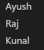
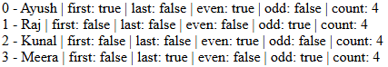
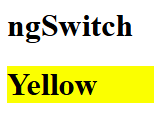

# Directive

A directive is a class that tells Angular how to modify/control DOM elements.  
If Components -> build the UI,  
Directives -> control how that UI behaves.


| Type                 | Purpose                     | Example              |
| -------------------- | --------------------------- | -------------------- |
| Structural Directive | Changes DOM structure, decide whether an element exists in the DOM or not, Always prefixed with *       | `*ngIf`, `*ngFor`, `*ngSwitch`    |
| Attribute Directive  | Changes style/behavior, Do not remove elements from DOM, Applied as attributes, No *, change how an element behaves, not whether it exists. | `ngClass`, `ngStyle`, `ngModel` |
> We need to import **CommonModule** for almost every directive,  
& **FormsModule** for ngModel
```ts
import { Component } from '@angular/core';
import { CommonModule } from '@angular/common';

@Component({
  selector: 'app-example',
  standalone: true,
  imports: [CommonModule],
  templateUrl: './example.component.html'
})
export class ExampleComponent {}
```

- Component Directives → What UI blocks exist
- Structural Directives → Which HTML elements should exist
- Attribute Directives → How existing elements should look or behave

---
### <center> *ngIf
*ngIf adds or removes elements from the DOM;  
it does NOT hide them using CSS.

 
```ts
// .ts
dataLoaded = true;
```
```html
<!-- .html -->
<p *ngIf="dataLoaded; else loadingBlock"> Data </p>

<ng-template #loadingBlock>
  <p>Loading...</p>
</ng-template>
```

So:  
❌ It doesn’t take space
❌ It’s not clickable
❌ It’s not in the code
❌ It doesn’t exist on the page at all, 
It’s like it was never written.

---
### <center> *ngFor
*ngFor creates copies of an HTML element for each item in an array.

```ts
names = ["Ayush", "Raj", "Kunal"];
```

```html
<p *ngFor="let n of names">{{ n }}</p>
<!-- For each value inside names, create one copy of the HTML used with ngFor -->
```


> It creates or destroys DOM elements for each item in the list.

**CONTEXT VARIABLES ?**  
Angular gives you extra information per loop item, called context variables :-  index, first, last, even, odd, count.

```ts
names = ["Ayush", "Raj", "Kunal", "Meera"];
```

```html
<div *ngFor="let name of names; 
      let i = index;
      let isFirst = first;
      let isLast = last;
      let isEven = even;
      let isOdd = odd;
      let total = count">

  {{ i }} - {{ name }}
  | first: {{ isFirst }}
  | last: {{ isLast }}
  | even: {{ isEven }}
  | odd: {{ isOdd }}
  | count: {{ total }}

</div>
```


- isFirst gets true only for the first item
- isLast gets true only for the last item
- total = total items
- isEven = index is even
- isOdd = index is odd

---
### <center>@for (new way)
NOT a directive, 
No *, 
No importing of CommonModule


```ts
@for (item of items; track item) {
  <div>{{ item }}</div>
}
```


---
### <center>*ngSwitch
A Structural Directive

```html
<div [ngSwitch]="color">
    <h1 *ngSwitchCase="'red'" style="background-color: red;">Red</h1>
    <h1 *ngSwitchCase="'yellow'" style="background-color: rgb(251, 255, 0);">Yellow</h1>
</div>
```
```ts
export class App {
  color = "yellow"
}
```


---
### <center> *ngClass
ngClass is used to add or remove CSS classes dynamically based on: conditions, values, API data, loop index etc.

`[ngClass]="{ 'CSS_CLASS_NAME': CONDITION }"`

```ts
isActive = true;
```

```html
<p [ngClass]="{ 'highlight': isActive }">Hello Ayush</p>
```

```css
.highlight { color: #e11d48; font-weight: 600; }
```
---
#### ngClass with MULTIPLE CLASSE :-
```html
<span [ngClass]="{
  'active-user': userStatus === 'active',
  'pending-user': userStatus === 'pending',
  'blocked-user': userStatus === 'blocked'
}">   {{ userStatus }}  </span>
```
---
### ngClass with ARRAY :-
Use it when:
You want to apply multiple classes directly.
```html
<div [ngClass]="['card', isBig ? 'big' : 'small']">
  Card Example
</div>
```
```css
.card { padding: 8px; border: 1px solid #ccc; }
.big { font-size: 24px; }
.small { font-size: 14px; }
```