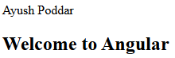
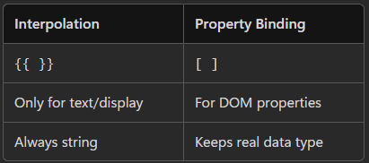
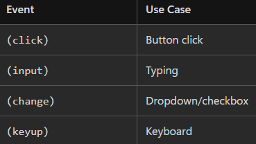
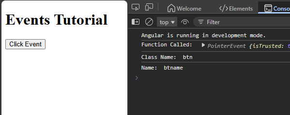
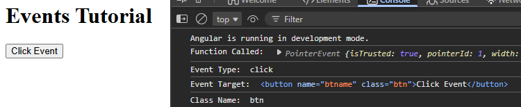
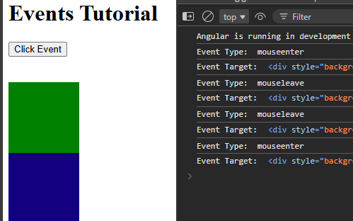
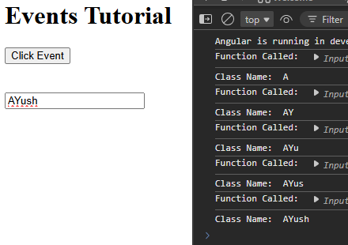

# DATA BINDING
Connects the (.ts) file with the Template (.html) file so the UI stays in sync with data.   

> **One way binding** :
  - .ts sends to .html : Interpolation { }, Property Binding [ ]
  - .html → .ts : Event Binding ( )

> **Two way (.ts <-> .html)** :  
  - Combines `[],()`  ie. `[(ngModel)]`

---

### <center>1. INTERPOLATION

> Showing a TypeScript variable value inside HTML  
```html
<p>{{ 5 + 5 }}</p> 
<p>{{ name.toUpperCase() }}</p>
<p>{{ age + 2 }}</p>
<p>{{ isActive ? 'Yes' : 'No' }}</p>
```
---
```ts
//app.ts
export class App 
{
  name="Ayush Poddar" 
  
  //functions not preferred
  getGreeting(){
    return "Welcome to Angular";
  }//runs after every change detection
}
```
```ts
// app.html
{{name}}
<h2>{{ getGreeting() }}</h2>
```

---

### <center> 2.  Property Binding

`[HtmlElementProperty]="valueOfTsVariable"`,  
value is a component property (TypeScript variable)

```ts
export class AppComponent {
  imageUrl = "https://picsum.photos/200"; 
}
```
```html
 //changes in dom
```

---

### <center> 3. Event Binding

Event binding lets you listen to user actions (events) from the UI and respond in your component (TypeScript).

`(event)="method()"`

`$event` gives access to actual DOM event



```html
<!-- app.html -->
<button (click)="fun($event)" class="btn" name="btname" > Click Event </button>
```
```ts
// app.ts
export class App 
{
  fun(e:any) //any as datatype
  {
    console.log("Function Called: ", e);
    console.log("Class Name: ", e.target.className);
    console.log("Name: ", e.target.name);
  }
}
```



---

### Mouse Event -
```ts
export class App 
{
  handleEvent(event:MouseEvent){ 
    console.log("Function Called: ", event);
    console.log("Event Type: ", event.type);
    console.log("Class Name: ", (event.target as Element).className);
  }
}
```



---
```html
<div (mouseenter)="handleEvent($event)"
style="background-color: green; width: 100px; height: 100px;">
</div>
<div (mouseleave)="handleEvent($event)"
style="background-color: rgb(19, 0, 128); width: 100px; height: 100px;">
</div>
```


---

### Input

```html
<input type="text"
(input)="handleEvent($event)">
```
```ts
export class App 
{
  handleEvent(event:Event){
    console.log("Function Called: ", event);
    console.log("Class Name: ", (event.target as HTMLInputElement).value);
  }
}
```


---

## 2‑WAY DATA BINDING / Template Driven Form

- When the user types in the input → the .ts variable updates ✅
- When the variable changes in .ts → the input updates ✅

---

### How  ?

Angular provides the directive: `[(ngModel)]`

It combines:
- Property Binding → data from .ts to .html
- Event Binding → data from .html to .ts

So data flows in **both directions**.

---

```html
<input [(ngModel)]="firstName">

<!-- Internally -->
<input
  [ngModel]="firstName"
  (ngModelChange)="firstName = $event"
/>
```
[ngModel] → send value to HTML  
(ngModelChange) → send value back to TS

---
### Necessities ?

### 1. For Standalone :-

1. ngModel is NOT built‑in, we need to import `FormsModule`
    ```ts
    import { FormsModule } from '@angular/forms';

    @Component({
      standalone: true,
      imports: [FormsModule]
    })
    ```
2. You must add name attribute:  
    ```html
    <input [(ngModel)]="firstName" name="firstName">
    ```

### Module Based :-

1. Open app.module.ts → add FormsModule
    ```ts
    //app.module.ts
    import { FormsModule } from '@angular/forms';

    @NgModule({
      declarations: [SellerAuth],
      imports: [FormsModule],
    })
    export class AppModule {}
    ```
---

Now from just databinding => Actual form control

Angular gives:  
- ngForm → creates a form object
- ngSubmit → handles submit
