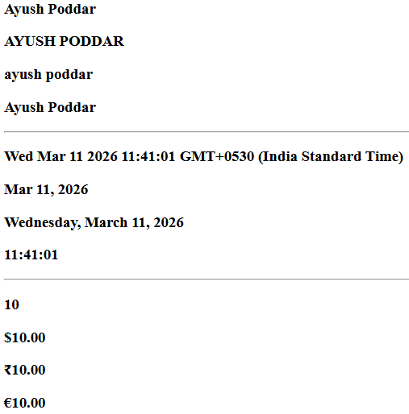
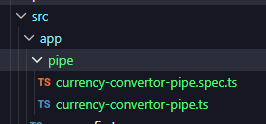
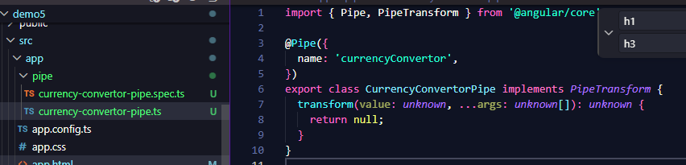

# Pipes
Way to transform data,  
E.g. changing case, currency symbol etc..

Css can be used too but this is much faster

Pipes are for display,  
Do NOT modify actual data  
Used ONLY in HTML templates  
They work together with interpolation {{ }}.

Syntax
> {{ value | pipeName }}

Most built‑in pipes come from `CommonModule`.

---
```TS
export class App {
  title = "Ayush Poddar"
  date = new Date()
  amount = 10
}
```
```HTML
<h3>{{title}}</h3>
<h3>{{title | uppercase}}</h3>
<h3>{{title | lowercase}}</h3>
<h3>{{title | titlecase}}</h3>

<h3>{{date}}</h3>
<h3>{{date | date}}</h3>
<h3>{{date | date:"fullDate"}}</h3>
<h3>{{date | date:"hh:mm:ss"}}</h3>

<h3>{{amount}}</h3>
<h3>{{amount|currency}}</h3>
<h3>{{amount|currency:"INR"}}</h3>
<h3>{{amount|currency:"EUR"}}</h3>
```



---
# <center> CUSTOM PIPE

> always create inside: src -> app -> pipe folder

> ng generate pipe pipeFolder/pipeName

Eg:-
```cmd
ng generate pipe pipe/currencyConvertor
```




Use the pipe name in the template using {{ value | pipeName }}