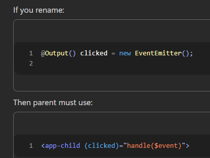

## <center> @Input

Allows a parent component to send data to a child component.

👉 Parent controls data  
👉 Child receives & displays it


For eg
```html
<!-- parent.html -->
<div>
    <app-child [name]="'Ayush'"></app-child>
</div>
```
```ts
// child.ts
export class ChildComponent {
  @Input() name: string = '';
  //name is now storing 'Ayush'
}
```

---

## <center> @Output
To send data from child to parent
```ts
//SYNTAX
import { Output,EventEmitter } from '@angular/core';

@Output() 
eventName = new EventEmitter();
```

We can create custom event with custom names



For eg
```ts
export class ChildComponent {

  @Output() notify = new EventEmitter<string>(); //create new evernt name notify

  sendData() {
    this.notify.emit('Hello from Child'); //sends data
  }
}
```
```html
<!-- parent.html -->
<app-child (notify)="handleMessage($event)"></app-child>
```
```ts
// parent.ts
handleMessage(message: string) {
  console.log(message);
}
```

---

## <center> TEMPLATE REFERENCE VARIBALE '#'
It is a way to store a reference to an HTML element or component directly inside the template.  
Template reference works ONLY inside HTML, You cannot directly access it in TS
```HTML
<input #inputBox>
<button (click)="Fun(inputBox.value)"> Print </button>
<!-- Sending parameter -->
```
```ts
Fun(value: string) {
  console.log(value);
}
```
Fast than using ngmodel and then accessing

---
## <center> @ViewChild
It allows you to access DOM elements or child components inside your TypeScript file

```ts
//SYNTAX
@ViewChild('referenceName') variableName!: type;
```
For eg :-   
```html
<input #inputBox>
<button (click)="focusInput()">Focus</button>
```
```ts
import { ViewChild, ElementRef } from '@angular/core';

@ViewChild('inputBox') input!: ElementRef;

focusInput() {
  this.input.nativeElement.focus();
}
```