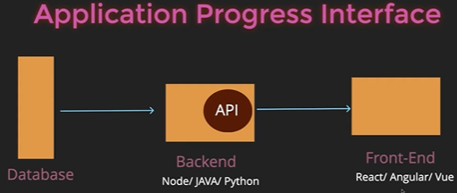

# ASYNCHRONOUS
In Js, there are 2 kinds of operations:
1. Synchronous (immediate)
    ```js
    const x = 10;   // value available immediately
    ```
2. Asynchronous (takes time)
    ```js
    fetch('/api/users') // data comes later
    ```

> How do I represent data that does NOT exist yet, but WILL exist later?  
JavaScript needs a container for future data.

Solutions :-
1. Callbacks ❌ messy
2. Promises ✅ better
3. Observables** ✅ powerful (Angular choice)

---
# API

Js can't be connected directly to your DB, as they executes on browser not on server
 
We have Server side scripting languages like java, python, node they can execute on server, we connect them with DB => Creates API



An API allows your Angular frontend to talk to a backend server.

---
# HTTP Client
Angular provides a built‑in service called: HttpClient

It handles:  
API calls, JSON conversion, Errors, Observables (streamed responses)

>  Import HttpClientModule

---
### <center> Observables ?
An Observable is a container that represents data that will arrive over time.
It can :-  
- Can return one or multiple values,  
- Do nothing until subscribed,  
- Can be canceled,  
- Perfect for APIs, events, streams

```ts
this.http.get('/api/users'); //returns observable
```

```ts
const users = this.http.get('/api/users');
console.log(users);
//Wont work coz, API request has not completed
```

---

### <center> Subscribe ?
subscribe( ) means:
“I want to listen to this Observable.”

Until you subscribe:  
❌ API call does NOT happen
❌ No network request
❌ No data
    
    Observable = recipe
    subscribe() = cooking the food
```ts
this.userService.getUsers().subscribe(data => {
  this.users = data;
});
```

What happens when you subscribe?
1. Starts HTTP request
2. Waits for server response
3. When data arrives → calls your function
4. Passes the data inside data
---
### Example :-
```ts
//User Service
import { Injectable } from '@angular/core';
import { HttpClient } from '@angular/common/http';

@Injectable({
  providedIn: 'root'
})

export class UserService {
  constructor(private http: HttpClient) {}

  getUsers() {
    return this.http.get('API_URL');
  }
}
```
Using the API in a COMPONENT
```ts
//home.component.ts
import { Component, OnInit } from '@angular/core';
import { UserService } from '../services/user.service';

@Component({
  selector: 'app-home',
  templateUrl: './home.component.html'
})

export class HomeComponent implements OnInit {

  usersArr: any[] = [];

  constructor(private us: UserService){} //child of service

  ngOnInit() {
    this.userService.getUsers().subscribe((data) => {
      this.usersArr = data;
    });
  }
}
```

---

### <center> SUMMARY
```
Observable = future data stream
HttpClient returns Observable
subscribe() starts the request
Data arrives inside subscribe
Services return Observables
Components subscribe
```