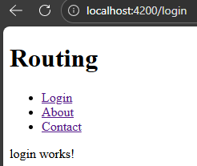

# Routing

Angular apps are Single Page Applications (SPA):  
Only one index.html, No full page reloads

Routing decides which component should be shown for a given URL.

Angular routing DOES:  
- Change the URL in the browser  
- Destroy the current component  
- Create & display a new component  
- Keep the app running

> RouterModule enables routing features in Angular
---
### Steps :-
1. Go to `app.routes.ts`
    ```ts
    import { Routes } from '@angular/router';
    import { About } from './about/about';
    import { Login } from './login/login';
    import { Contact } from './contact/contact';

    export const routes: Routes = [
      {path:'about', component:About}, // No / path
      {path:'login', component:Login},
      {path:'contact', component:Contact}
    ];
    ```
3. Go to `app.ts` and  
`imports: [RouterOutlet, RouterLink],`

4. Go to `app.html`
    ```html
    <ul>
        <li>
            <a routerLink="/login">Login</a>
        </li>
        <li>
            <a routerLink="/about">About</a>
        </li>
        <li>
            <a routerLink="/contact">Contact</a>
        </li>
    </ul>

    <router-outlet/> //Where to attach
    ```



---
### <center> 404

When some route doesnot exists, it open that page

```ts
export const routes: Routes = [
    {path:'about', component:About}, //
    { path: '', redirectTo: 'home', pathMatch: 'full'},
    {path:'**', component:PageNotFound}, //this
];
```
---

```ts
loginSuccess() {
  this.router.navigate(['/dashboard']); //After logic
}
```
---

### ROUTE PARAMETERS
You don’t want routes like:  
/user1  
/user2  
Instead, you want:  
/user/1  
/user/2

```ts
//app.routes.ts

{ path: 'user/:id', component: UserComponent } 
            //:id is a placeholder.
```
```ts
//component.ts

constructor(private route: ActivatedRoute) {}

ngOnInit() {
  const id = this.route.snapshot.paramMap.get('id');
}
```

---
# ROUTE GUARDS

You don’t want:
`/dashboard`
to be accessible by anyone.

```ts
{
  path: 'dashboard', 
  component: DashboardComponent,
  canActivate: [AuthGuard]
}
```

# LAZY LOADING
Large apps load too much code upfront  
Lazy loading solves:
“Load a feature ONLY when user visits it” 

```ts
{
  path: 'admin',
  loadComponent: () =>
    import('./admin/admin.component').then(m => m.AdminComponent)
}
```