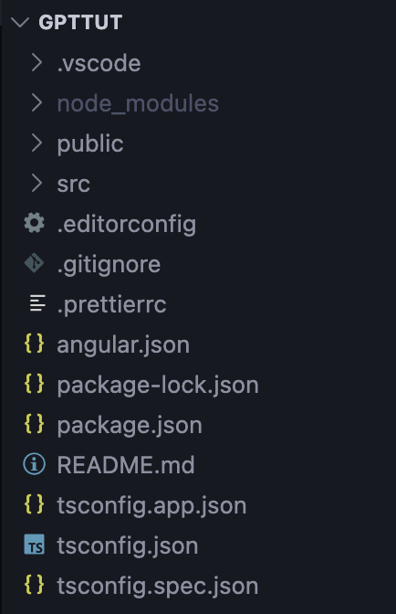

# INTRODUCTION

### ANGULAR ?   
Released in 2010 by Google  
Created by Misko Hevery and Adam Abrons  
Originally called AngularJS (version 1.x)  
JS Framework
Based on MVC Architecture.  

Angular Js(Depreciated), currently we use Angular

---
INSTALLATION ?

Go to https://angular.dev/installation  

Install Angular CLI (@angular/cli) once using  
`npm install -g @angular/cli`   
-g means global

Verify using 
`ng version`

---
### For Every New Project:-
Go to that folder  
`ng new <ProjectName>`  
`cd <ProjectName>`  
`ng serve`  To run server  
It will run on 
 http://localhost:4200/

---
### REACT Vs ANGULAR  
    npm create vite@latest → ng new  
    npm run dev            → ng serve  
    Dev server default port:  
      Vite → 5173  
      Angular → 4200

---
### FILE & FOLDER STRUCTURE :-  

Root Level :-

- .vscode : VS Code settings for this project only.  
- node_modules : All installed dependencies.
- public : Static assets.
- src: Inside src:
    - main.ts → Entry point (bootstraps Angular app)
    - index.html → Main HTML file
    - styles.css → Global styles
    - app → Your real application code
- .editorconfig : Controls indentation rules for the project.
- .prettierrc : Formatting rules (if using Prettier).
- angular.json : Angular project configuration.
- package.json
- tsconfig.app.json : TypeScript config specifically for app files.
- tsconfig.json : TypeScript configuration. 
- tsconfig.spec.json : TypeScript config for test files.             