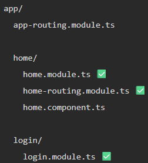

# <center>Routing

Traditional websites (old-school):

You click a link ->
Browser sends a request to the server ->
Server sends back a new HTML page ->
Browser reloads the whole page

👉 Every click = full page reload

---
BUT Angular apps are Single Page Applications (SPA):  
Only one index.html -> That file is loaded once ->
The browser never reloads the page again

👉 After the first load, everything happens inside the same page.

---
### What Routing ACTUALLY does ?

✅ Angular Router is constantly watching the URL   
✅ It parses the url into path, params etc                                         
✅ Matches routes from app.routes.ts  
✅ Checks Guards  
✅ Component lifecycle, Old component destroyed, New created  
✅ Angular inserts component into ``<app-router>``  
✅ Change detection runs  
✅ UI updates automatically

>   Angular routing works entirely on the client side after initial load


---
## <center> Core Pieces
### (1) Routes (Configuration)
Defines mapping in app.routes.ts :-


### (2) Router Outlet (Display Area)
👉 Where content shows  
When route matches:
Angular creates component instance &
Inserts it inside `<router-outlet>...</router-outlet>`

---

```html
<app-navbar></app-navbar>
<router-outlet></router-outlet>
<app-footer></app-footer>
```
Now AppComponent says:  
Navbar always visible.  
Middle section changes according to route.  
Footer always visible.  

---

## <CENTER> Route Configuration

An array of objects that defines:  
URL path → What should happen

```ts
const routes: Routes = [
  { path: 'home', component: HomeComponent },
  { path: 'login', component: LoginComponent },
  { path: 'about', component: AboutComponent }
];
```
Empty Path :-
`{ path: '', component: HomeComponent }`  
Empty path ' ' represents the root URL (/)


### REDIRECTS -

```ts
{ path: '', redirectTo: 'home', pathMatch: 'full' }
```
Do NOT render component → Just change URL 

**pathMatch** ?  
Angular can match routes in two ways:  
1. `prefix`: default behaviour i.e. Match starting part of URL  
`{ path: '', redirectTo: 'home' }`  
Angular interprets ' ' or / as a prefix of every URL,   
Result:
👉 Infinite redirect loop as every url starts with `/`
2. `full`   
`{ path: '', redirectTo: 'home', pathMatch: 'full' }`: Only redirect when the entire URL is exact `\`

> Always use `pathMatch: 'full'` for empty routes
---

#### WILDCARD ROUTE

```ts
{ path: '**', component: PageNotFoundComponent }
```  
Match ANY URL that was not matched before, Many routes don’t exist.  
Without wildcard:
❌ App breaks / blank screen  
Wildcard must ALWAYS be last


### <CENTER> ROUTE ORDER

1. Angular Checks first route
2. If match → stops
3. Does NOT check further

```ts
//correct order
const routes = [
  { path: '', redirectTo: 'auth', pathMatch: 'full' },
  { path: 'auth', component: LoginComponent },
  { path: '**', component: NotFoundComponent }
];
```


---
## <center> NAVIGATION
Changing URLs

### 1. routerLink (HTML) -
`routerLink` is a directive that :-  
Prevents default browser reload,   
Updates URL internally,  
Triggers router,  
Router does the rest, change of component

**Why NOT use href ?**  
Browser performs full page reload, Angular app restarts, State is lost

```TS
// Absolute Path
<a routerLink="/home">Home</a>

// Removes existing path, starts from root
```
```ts
// Relative Path
<a routerLink="home">Home</a>

// Based on your current route, It appends to current path.
```

---
**ARRAY SYNTAX :-**  
lets you pass dynamic, structured navigation values  
Easily can pass query params.  
```HTML
<a [routerLink]="['/home']">Home</a>
```
```html
<a [routerLink]="['/user', 10]">User</a>

Built URL is : /user/10
```
More Eg.
```html
<a [routerLink]="['/user', user.id]">User</a>
```

---

**Active Link Styling :-**  
It adds a CSS class when the route linked to is currently active
```html
<a routerLink="/about" routerLinkActive="active"> About </a>
```
Applies active CSS class when route matches, for eg if want to hightlight current thing in navbar

Works on Nested routes too, To avoid :-
```html
<a
  routerLink="/about" 
  routerLinkActive="active"
  [routerLinkActiveOptions]="{ exact: true }"
>
</a>

/about      → active ✅
/about/team → NOT active ❌
```

---

### 2. Programmatic(ts) | router.navigate() -

Step 1 : Injecting the Router :-
```ts
import { Router } from '@angular/router';

constructor(private router: Router) {}
```


```ts
this.router.navigate(['/user', 10]); //preferred
// OR
this.router.navigateByUrl('/user/10');
```
Relative Navigation :-
```ts
this.router.navigate(['profile'], {
  relativeTo: this.route
});

// If current : /home
// then : /home/profile
```

---

## <center> - Route Parameters -
Dynamic values in the URL that Angular can capture and use inside a component, Route parameter = variable inside URL

```ts
{ path: 'user/:id', component: UserComponent }
// :id is a placeholder (dynamic part)
```
Works for: ` /user/anything`, `/user/1`, `/user/69`

---
**NAVIGATION having router params :-**
1. Using routerLink (HTML)
    ```HTML
    <a [routerLink]="['/user', 10]">User</a>
    <!-- Navigates to: /user/10 -->
    ```
2. Using Ts (navigate( ))
   ```ts
   this.router.navigate(['/user', 10]);
   ```

---
### Reading Route Param :-

**Step 1**: Import & Inject ActivatedRoute
```ts
import { ActivatedRoute } from '@angular/router';

constructor(private route: ActivatedRoute) {}
```

**What is ActivatedRoute?**  
It gives information about the current route  
👉 Includes: params, query params, route data

**Step 2**: Read the parameter, Two ways:-
  1. **Using snapshot :-**
      ```ts
      ngOnInit() 
      {
        const id = this.route.snapshot.paramMap.get('id'); 
        
        console.log(id); // id="10"
      }
      ```
      `paramMap.get( )` always returns string.   
      `snapshot` = “take value once when component loads”


  2. **Using Observable :-**
      ```ts
      ngOnInit() {
        this.route.paramMap.subscribe(params => {
          const id = params.get('id');
          console.log(id);
        });
      }
      ```
      It is listening continuously, where as snapshot = one-time read
---
## <center> - Query Parameters -
Extra data added to the URL after `?`
```rust
/route?key1=value1&key2=value2

Eg:-
/home?name=ayush&age=25
```

- `/home` → route path
- `?name=ayush&age=25` → query parameters

Route param = identifies resource  
Query param = modifies behavior  
Query params do NOT change component

**USES :-**  
The same component stays active &  
Only filtering / sorting / searchin / extra options changes

**NAVIGATION :-**
1. Using HTML   
   ```html
   <a
    [routerLink]="['/home']" 
    [queryParams]="{ name: 'ayush', age: 25 }">
   </a>
   ```
   Result : `/home?name=ayush&age=25`

2. Using Ts
    ```ts
    this.router.navigate(['/home'], {
      queryParams: { name: 'ayush', age: 25 }
    });
    ```

**READING QUERY PARAMS FROM URL :-**

Step 1: Importing and injecting ActivatedRoute
```ts
import { ActivatedRoute } from '@angular/router';

constructor(private route: ActivatedRoute) {}
```

For eg: `/home?name=ayush&age=25`

Step 2 : Either
  ```ts
ngOnInit() {
  const N = this.route.snapshot.queryParamMap.get('name');
  const A = this.route.snapshot.queryParamMap.get('age');

  console.log(N, A);
}
  ```

```ts
ngOnInit() {
  this.route.queryParams.subscribe(params => {
    console.log(params['category']);
    console.log(params['page']);
  });
}
```
---

## <center> Nested Routing
#### 1. Absolute
`<a routerLink="/home/profile"> Go </a>`  

`this.router.navigate(['/home/profile']);`

#### 2. Relative
Assume you already on `/home`  

```html
<a routerLink="profile">Go</a>
```
```ts
this.router.navigate(['profile'], {
  relativeTo: this.route
});
```

Goes to `/home/profile`

#### 3. Children
Routes inside another route
```ts
{
  path: 'home',
  component: HomeComponent,
  children: [
    { path: 'profile', component: ProfileComponent }
  ]
}
```
```
/profile ❌ does NOT exist, child
/home/profile ✅ does exist
```
Good practice to make a default child route
```ts
{
  path: 'home',
  component: HomeComponent,
  children: [
    { path:'', redirectTo: 'profile', pathMatch: 'full' },
    { path:'profile', component: ProfileComponent }
  ]
}
```
Now if user goes to:
`/home`  
1. Angular Loads parent
2. Matches ' '
3. Redirects to /home/profile

---
## <center> -LAZY LOADING-
Load features only when user visits them  
Without lazy loading, When app starts:  
Angular loads EVERYTHING
(all modules, all components)

Lazy Loading = loading a module only when its route is visited

Earlier you had: route → component  
Now: route → module → component

```ts
{
  path: 'home',

  loadChildren: () =>
    import('./home/home.module').then(m => m.HomeModule)
}
//When user visits /home, load home.module.ts, then use HomeModule from it
```
Practical Eg:-



```ts
const routes = [
  {
    path: 'home',
    loadChildren: () =>
      import('./home/home.module').then(m => m.HomeModule)
  }
];
```
User goes to /home  
path: 'home' → load HomeModule  
Angular loads: home.module.ts ✅  
Inside that module, Angular sees its routing: home-routing.module.ts ✅

---

## <center> ROUTE GUARDS
A guard is a check that runs before navigation happens

**Why we use guards ?**  
To control access based on:  
Login status, 
Permissions, 
Roles, 
Conditions

```ts
{
  path: 'home',
  component: HomeComponent,
  canActivate: [AuthGuard]
}

// Before going to /home, run AuthGuard
```
AuthGuard = a class you created,
You define its logic

