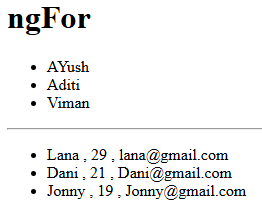
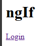
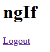
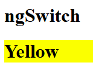

# Directive

A Class that adds additional behavior to elements in your applications.  

A feature that gives more power to DOM Elements.

TYPES -  
1. Component 
2. Structural
3. Attribute 

---
### *ngFor
We can use loops in template file(.html)

```ts
export class App {
  students = ["AYush", "Aditi", "Viman"];

  studentsData = [
    {
      name:"Lana",
      age:"29",
      email:"lana@gmail.com"
    },
    {
      name:"Dani",
      age:"21",
      email:"Dani@gmail.com"
    },
        {
      name:"Jonny",
      age:"19",
      email:"Jonny@gmail.com"
    }
  ]
}
```
```html
<h1>ngFor</h1>

<ul>
    <li *ngFor="let x of students">
        {{x}}
    </li>
</ul>

<hr>

<ul>
    <li *ngFor="let s of studentsData">
         {{s.name}} , {{s.age}} , {{s.email}}
    </li>
</ul>
```



---

### ngIf
 
```ts
export class App {
  isLoggedOut = false;
}
```
```html
<h1>ngIf</h1>

<div *ngIf="isLoggedOut; else elseBlock">
    <a href="/">Login</a>
</div>

<ng-template #elseBlock>
    <a href="/">Logout</a>
</ng-template>
```



---
### ngSwitch
A Structural Directive

```html
<h1>ngSwitch</h1>

<div [ngSwitch]="color">
    <h1 *ngSwitchCase="'red'" style="background-color: red;">Red</h1>
    <h1 *ngSwitchCase="'blue'" style="background-color: rgb(4, 0, 255);">Blue</h1>
    <h1 *ngSwitchCase="'green'" style="background-color: rgb(51, 255, 0);">Green</h1>
    <h1 *ngSwitchCase="'yellow'" style="background-color: rgb(251, 255, 0);">Yellow</h1>
</div>
```
```ts
export class App {
  color = "yellow"
}
```
