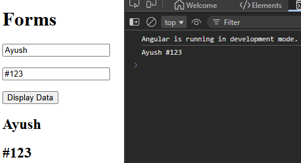
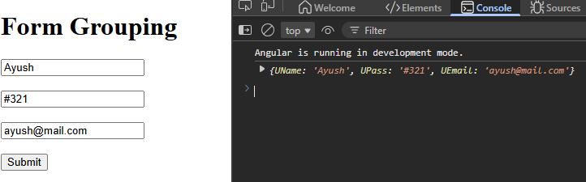

# Form

### 1️⃣ TEMPLATE-DRIVEN FORMS
👉 Simple  
👉 Logic mostly in HTML  
👉 Uses ngModel  

### 2️⃣ REACTIVE FORMS

👉 More control  
👉 Logic in TypeScript  
👉 Uses FormGroup, FormControl

---


---
### <center> 1️⃣ ngForm (Form Object)

```html
<form #myForm="ngForm">
```

`#myForm` is variable,  # is used to create a local variable inside HTML.  
Angular already has something called `ngForm`
(it represents the whole form)

>Take Angular’s form object (ngForm) & store it in my variable myForm

Now Angular tracks:
All inputs, their values, form state

`console.log(myForm.value)` => We can access everyinput

---
### <center> 2️⃣ ngSubmit (Submit handler)
```html
<form (ngSubmit)="onSubmit(myForm)">
```

( ) → event binding  
ngSubmit → submit event  
onSubmit → your function  
myForm → your variable


👉When user clicks submit:  
Angular prevents reload, Calls your function, Sends full form data

For e.g.  
```html
<form #sellerSignup="ngForm" (ngSubmit)="signUp(sellerSignup.value)">
  <input type="text" ngModel name="name">
  <input type="password" ngModel name="password">
  <input type="text" ngModel name="email">
  <button>Sign Up</button>
</form>
```
Angular automatically builds this object for you:

```ts
sellerSignup.value = {
  name: "whatever user typed",
  password: "whatever user typed",
  email: "whatever user typed"
}
//then
(ngSubmit)="signUp(sellerSignup.value)"
//You directly pass all form data as an object
```
---
## <center> VALIDATIONS

```html
<input type="email" required>
<input type="password" minlength="6">
```
How do we know based on input type, is the given input even valid ?

```html
<input name="name"
  [(ngModel)]="name"
  #nameRef="ngModel"
  required
>
<!-- Create variable nameRef, which holds this input’s state
Now we can check using -->

nameRef.valid
nameRef.invalid
nameRef.touched
```

#### Show error message :-
```html
<div *ngIf="nameRef.invalid && nameRef.touched">
  Name is required
</div>
```

#### Disable submit if form invalid :-
```html
<button type="submit" [disabled]="myForm.invalid">
  Submit
</button>
```


---
## Reactive
When complexity is there 


```html
<form>

  <input type="text" placeholder="Enter Name" [formControl]="userName"> <!--linking variable-->

  <input type="text" placeholder="Enter password" [formControl]="userPass">

  <button type="button" (click)="displayValue()" >Display Data</button>

  <h2>{{userName.value}}</h2>
  <h2>{{userPass.value}}</h2>
</form>

```
```ts
export class App {
  userName = new FormControl(); //to link with form
  userPass = new FormControl();

  displayValue(){
    console.log(this.userName.value, this.userPass.value)
  }
}
```


---

### <center>Form Grouping



```html
<form [formGroup]="profileForm" (ngSubmit)="onSubmit()">

  <input type="text" placeholder="Enter name" formControlName="UName">

  <input type="text" placeholder="Enter password" formControlName="UPass">

  <input type="text" placeholder="Enter email" formControlName="UEmail">

  <button>Submit</button>

  <button type="button" (click)="setValue()" >Set Value</button>

</form>
```

```ts
export class App {
  
profileForm = new FormGroup(
  {
    UName:new FormControl("Deafult"),
    UPass:new FormControl("DefPass"),
    UEmail:new FormControl("DefMail"),
  }
)

onSubmit(){
  console.log(this.profileForm.value);
}

setValue(){
  this.profileForm.setValue({
    UName:"Ayush",
    UPass:"123#",
    UEmail:"ayush@mail.com"
  })
}

}

```