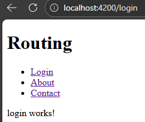

# Routing

1. Generate all required components
2. Go to `app.routes.ts`
    ```ts
    import { Routes } from '@angular/router';
    import { About } from './about/about';
    import { Login } from './login/login';
    import { Contact } from './contact/contact';

    export const routes: Routes = [
        // Add path & component
        {path:'about', component:About},
        {path:'login', component:Login},
        {path:'contact', component:Contact}
    ];
    ```
3. Go to `app.ts` and  
`imports: [RouterOutlet, RouterLink],`

4. Go to `app.html`
    ```html
    <ul>
        <li>
            <a routerLink="/login">Login</a>
        </li>
        <li>
            <a routerLink="/about">About</a>
        </li>
        <li>
            <a routerLink="/contact">Contact</a>
        </li>
    </ul>

    <router-outlet/>
    ```


---

### <center> 404

When some route doesnot exists, it open that page

```ts
export const routes: Routes = [
    {path:'about', component:About},
    {path:'', component:Home},
    {path:'**', component:PageNotFound}, //this
];
```
---

### To Do Lecture 36 3

#### 1. 

```html
<!-- home.html -->
<a [routerLink]="['profile', {name:'Ayush Poddar'}]">Go To Profile Page</a>

<!-- Earlier -->
 <a routerLink="profile">Go To Profile Page</a>
```
```ts
export class Profile {

  userName: string|null = "";

  constructor(private route:ActivatedRoute){}

  ngOnInit(){
    this.userName = this.route.snapshot.paramMap.get('name');
  }
}
```
