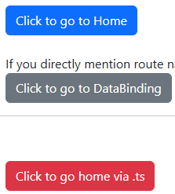

# Routing

1. Go to `app.routes.ts`
    ```ts
    import { Routes } from '@angular/router';
    import { About } from './about/about';
    import { Login } from './login/login';
    import { Contact } from './contact/contact';

    export const routes: Routes = [
        {path:'about', component:About},
        {path:'login', component:Login},
        {path:'contact', component:Contact}
    ];
    ```
3. Go to `app.ts` and  
`imports: [RouterOutlet, RouterLink],`

4. Go to `app.html`
    ```html
    <ul>
        <li>
            <a routerLink="/login">Login</a>
        </li>
        <li>
            <a routerLink="/about">About</a>
        </li>
        <li>
            <a routerLink="/contact">Contact</a>
        </li>
    </ul>

    <router-outlet/> //Where to attach
    ```


---
### <center> 404

When some route doesnot exists, it open that page

```ts
export const routes: Routes = [
    {path:'about', component:About},
    {path:'', component:Home},
    {path:'**', component:PageNotFound}, //this
];
```
---
### <center> PRACTICAL



```html
<button routerLink=""> Click to go to Home </button>

<button routerLink="/dataBinding"> Click to go DataBinding </button>

<!--OTHER WAY -->
<button (click)="navigatetohome()">Click to go home via .ts</button>
```

```ts
export class Routing {

  //Create router obect first
  constructor(private rt: Router){}

  //Use navigateByUrl() function
  navigatetohome(){
    this.rt.navigateByUrl("/")
  }
}
```