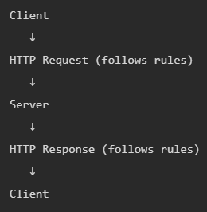

# 
 Introduction

### CLIENT ?  
Anything that -
Send Requests, Wait for Response & then use it

---
### REQUEST ?
Message sent by the client, to the server, asking for something.

A request has 4 main parts:
1. **Method (What action?)**  
GET → get data  
POST → send new data  
PUT → replace  
PATCH → update partial data   
DELETE → remove

2. **URL** (address of a specific resource on the server)  
http://localhost:3000/seller

	http → how to talk  
	localhost → which machine (server)  
	3000 → which port (door on that machine)   
    /seller → which resource inside

3. **Headers** (extra info)  
Tell server what type of data you're sending, 
Send authentication token, Control caching, etc.

4. **Body** (actual data, optional)  
Only used in: POST, PUT, PATCH

---
### 
SERVER ?

1. Listen for Requests
2. Process Logic
3. Interact with Database
4. Send Response

**Server components** :-
- Controller:
Handles incoming requests
- Database Layer:
Fetch/save data
- Service Layer:
Contains business logic, responses back

Server does NOT remember past requests

---

### 
RESPONSE ?
Message sent by the server, back to the client, after processing a request

**What response contains** ?
1. **Status code**  
Tells whether request was successful or failed

		•	200 → OK (success)
		•	201 → Created (POST success)
		•	400 → Bad request (client error)
		•	401 → Unauthorized
		•	403 → Forbidden
		•	404 → Not Found
		•	500 → Server Error

2. **RESPONSE BODY (Actual Data)**  
Not all responses have body (e.g., DELETE)  
Errors may also return body (error message)  

3. **HEADERS** 

---

## 
 HTTP
HyperText Transfer Protocol  
Set of rules that define how a request and response should be formatted and exchanged.

Without rules:  
Client sends random text  
Server doesn't understand  
Chaos ❌

> HTTP is Stateless ie. No Memory

**HTTP** : Not secure, Data visible  
**HTTPS** (used everywhere) :  
Secure connection, 
Data encrypted