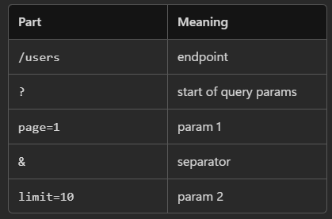
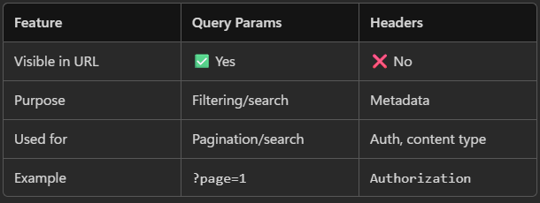

# Query Params
Extra data added to URL to modify the request.  

`/users?page=1&limit=10`


---
### Uses :- 
1. Pagination : `/users?page=2&limit=10`
2. Filtering : `/users?role=admin`
3. Searching : `/users?name=ayush`
4. Sorting : `/users?sort=asc`

---
### Sending Parameters :-

```ts
this.http.get('/users', {
  params: {
    page: 1,
    limit: 10
  }
}).subscribe();
```

> /users?page=1&limit=10

---

# <center> HTTP Header
Headers are extra metadata sent with request

### Uses :-
1. Authentication : `Authorization: Bearer <token>`
2. Content Type : `Content-Type: application/json`
3. Custom Info : `x-app-version: 1.0`

---
### Sending Headers:-
```ts
this.http.get('/users', {
  headers: {
    Authorization: 'Bearer token123'
  }
}).subscribe();
```
Method 2 (Using HttpHeaders, More Structured Way):-
```ts
import { HttpHeaders } from '@angular/common/http';

const headers = new HttpHeaders()
  .set('Authorization', 'Bearer token123');

this.http.get('/users', { headers }).subscribe();
```



---

Full Example :-
```ts
this.http.get('/users', {
  params: {
    page: 1,
    limit: 10
  },
  headers: {
    Authorization: 'Bearer token123'
  }
}).subscribe(data => {
  console.log(data);
});
```