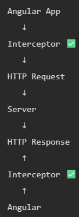
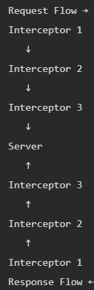

# HTTP Interceptors

Imagine you’re making multiple API calls:
```ts
this.http.get('/users', { headers: { Authorization: 'Bearer xyz' } });
this.http.post('/orders', data, { headers: { Authorization: 'Bearer xyz' } });
this.http.get('/profile', { headers: { Authorization: 'Bearer xyz' } });
```

Problems:  
Repeating headers everywhere, Messy code, Hard to maintain, Error handling everywhere

> An Interceptor is a middleware, that sits between Angular & server, can modify requests & responses automatically

A global handler for all HTTP requests and responses


### What can Interceptors do?
1. Modify Request: Add headers globally
2. Handle Response: Transform data
3. Handle Errors: Globally   
4. Logging / Debugging: 
Print all requests/responses

---

## <center>Implementation :-

    ng generate interceptor auth

What Angular creates: `auth.interceptor.ts`

Register it
1. Standalone
    ```ts
    import { provideHttpClient, withInterceptors } from '@angular/common/http';
    import { authInterceptor } from './auth.interceptor';

    providers: [
        provideHttpClient(
            withInterceptors([authInterceptor])
        )
    ]
    ```
2. Module Based
    ```ts
    import { HTTP_INTERCEPTORS } from '@angular/common/http';

    providers: [
        {
            provide: HTTP_INTERCEPTORS,
            useValue: authInterceptor,
            multi: true
        }
    ]
    ```

Basic Structure :-
```ts
import { HttpInterceptorFn } from '@angular/common/http';

export const authInterceptor: HttpInterceptorFn = (req, next) => {
  return next(req);
  // If you don’t call next(req) → request stops
};
```

Modify Request (Add Header)
```ts
export const authInterceptor: HttpInterceptorFn = (req, next) => {

  const modifiedReq = req.clone({
    setHeaders: {
      Authorization: 'Bearer my-token'
    }
  });

  return next(modifiedReq);
};
```

Why `clone( )`?  
Request objects are immutable.
> “Create a new request with modifications”

---
**We have Multiple Interceptors** :-  

🔐 Auth Interceptor → adds token  
📊 Logging Interceptor → logs requests  
⚠️ Error Interceptor → handles errors  

Usual order
1. Auth Interceptor (adds token)
2. Logging Interceptor (optional)
3. Error Interceptor (handles errors)
---



---
### Implementation
```ts
provideHttpClient(
  withInterceptors([
    authInterceptor,
    loggingInterceptor,
    errorInterceptor
  ])
)
```

```ts
// Logging
export const loggingInterceptor: HttpInterceptorFn = (req, next) => {

  console.log('Request sent:', req.url);

  return next(req).pipe(
    tap(() => console.log('Response received'))
  );
};
```

```ts
//Error
export const errorInterceptor: HttpInterceptorFn = (req, next) => {

  return next(req).pipe(
    catchError(err => {
      console.log('Error:', err);
      return throwError(() => err); //must return
    })
  );
};
```