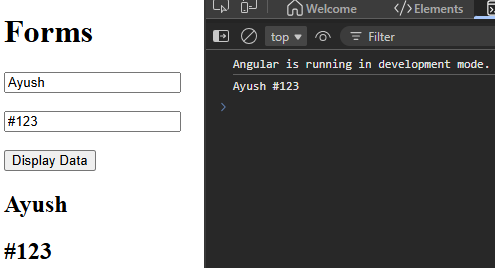
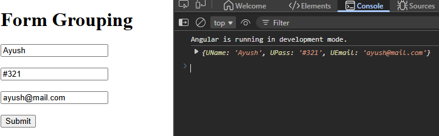

# Form

Types :- Reactive | Template

## Reactive
When complexity is there 


```html
<form>

  <input type="text" placeholder="Enter Name" [formControl]="userName"> <!--linking variable-->

  <input type="text" placeholder="Enter password" [formControl]="userPass">

  <button type="button" (click)="displayValue()" >Display Data</button>

  <h2>{{userName.value}}</h2>
  <h2>{{userPass.value}}</h2>
</form>

```
```ts
export class App {
  userName = new FormControl(); //to link with form
  userPass = new FormControl();

  displayValue(){
    console.log(this.userName.value, this.userPass.value)
  }
}
```


---

### <center>Form Grouping



```html
<form [formGroup]="profileForm" (ngSubmit)="onSubmit()">

  <input type="text" placeholder="Enter name" formControlName="UName">

  <input type="text" placeholder="Enter password" formControlName="UPass">

  <input type="text" placeholder="Enter email" formControlName="UEmail">

  <button>Submit</button>

  <button type="button" (click)="setValue()" >Set Value</button>

</form>
```

```ts
export class App {
  
profileForm = new FormGroup(
  {
    UName:new FormControl("Deafult"),
    UPass:new FormControl("DefPass"),
    UEmail:new FormControl("DefMail"),
  }
)

onSubmit(){
  console.log(this.profileForm.value);
}

setValue(){
  this.profileForm.setValue({
    UName:"Ayush",
    UPass:"123#",
    UEmail:"ayush@mail.com"
  })
}

}

```