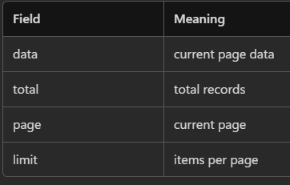

## CONTROL API responses using query params

Endpoint = /users  
Everything else = Query Params

## <center> PAGINATION
**Why Pagination** ?  
`GET /users` → returns 10,000 users.  
**Problems**:  
Slow UI, High memory, Bad UX

Backend handles pagination  
Frontend only controls page number

---
`/users?page=2&limit=5`
```
{
  "data": [...],
  "total": 100,
  "page": 2,
  "limit": 5
}
```



---

```ts
getUsers(page: number, limit: number) {
  return this.http.get('/users', {
    params: {
      page,
      limit
    }
  });
}
```
```ts
currentPage = 1;
limit = 5;

loadUsers() {
  this.userService.getUsers(this.currentPage, this.limit)
    .subscribe(res => {
      this.users = res.data;
      this.total = res.total;
    });
}
```
```ts
next() {
  this.currentPage++;
  this.loadUsers();
}

prev() {
  if (this.currentPage > 1) {
    this.currentPage--;
    this.loadUsers();
  }
}
```