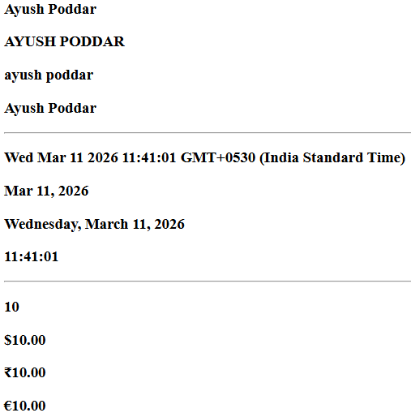
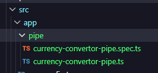
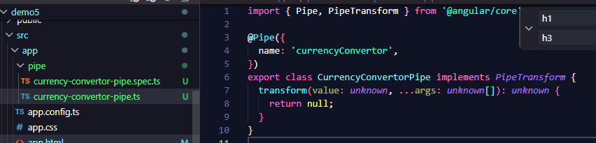

# Pipes
Way to transform data,  
Eg changing case, currency symbol etc..

Css can be used too but this is much faster

---
1. Add `commonModules` in .ts file



```HTML
<h3>{{title}}</h3>
<h3>{{title | uppercase}}</h3>
<h3>{{title | lowercase}}</h3>
<h3>{{title | titlecase}}</h3>

<h3>{{date}}</h3>
<h3>{{date | date}}</h3>
<h3>{{date | date:"fullDate"}}</h3>
<h3>{{date | date:"hh:mm:ss"}}</h3>

<h3>{{amount}}</h3>
<h3>{{amount|currency}}</h3>
<h3>{{amount|currency:"INR"}}</h3>
<h3>{{amount|currency:"EUR"}}</h3>
```

```TS
export class App {
  title = "Ayush Poddar"
  date = new Date()
  amount=10
}
```

---
# <center> CUSTOM PIPE

> always create inside src/app/pipe folder

`ng generate pipe pipeFolder/pipeName`
ie. 

`ng generate pipe pipe/currencyConvertor`




copy name and paste in app.ts