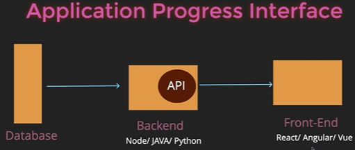
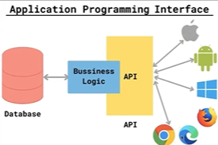
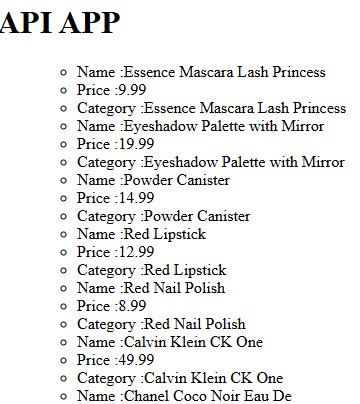

# API

Js can't be connected directly to your DB, as they executes on browser not on server

API -  
We have Server side scripting languages like java, python, node they can execute on server, we connect them with DB => Creates API




An API allows your Angular frontend to talk to a backend server.

Real Angular apps follow this flow :-  
Component -> Service -> HttpClient -> API Server

---

1. Create a service

    ```ts
    export class Products {

    apiURL = "https://dummyjson.com/products"

    constructor(private http:HttpClient){} //main

    getProducts(){
        return this.http.get<any>(this.apiURL); 
        //any req like get put post
    }

    }
    ```

2. Establing connection with service

    ```ts
    //app.ts

    export class App 
    {

    productData:any = signal("") //To store

    constructor(private productService:Products){} //importing service as instance

    ngOnInit(){
        this.productService.getProducts().subscribe((data)=>{
        console.log(data);
        
        this.productData.set(data.products) //storing
        })
    }
    }
    ```

3. Displaying on HTML
    ```html
    <h1>API APP</h1>

    <ul> 
    @for (product of productData(); track product.id){

        <ul>
        <li> Name :{{ product.title}} </li>
        <li> Price :{{ product.price}} </li>
        <li> Category :{{ product.title}} </li>
        </ul>
    }
    </ul>
    ```

