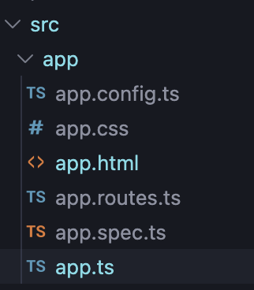

# INTERPOLATION

> Showing a TypeScript variable value inside HTML 



```ts
//app.ts

import { Component, signal } from '@angular/core';
import { RouterOutlet } from '@angular/router';

@Component({
  selector: 'app-root',
  imports: [RouterOutlet],
  templateUrl: './app.html',
  styleUrl: './app.css'
})
export class App {
  name="Ayush Poddar" //variable to be shown in .html file
}
```
```ts
// app.html

{{name}}
```

---