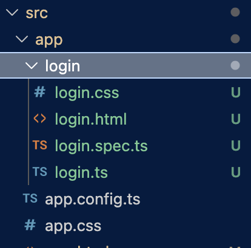
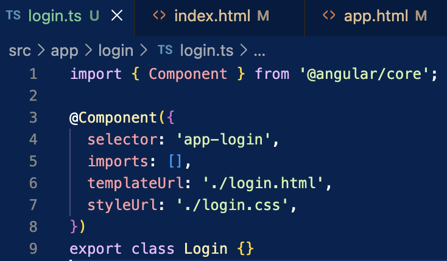
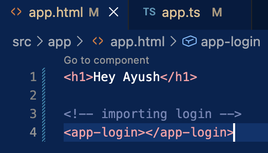
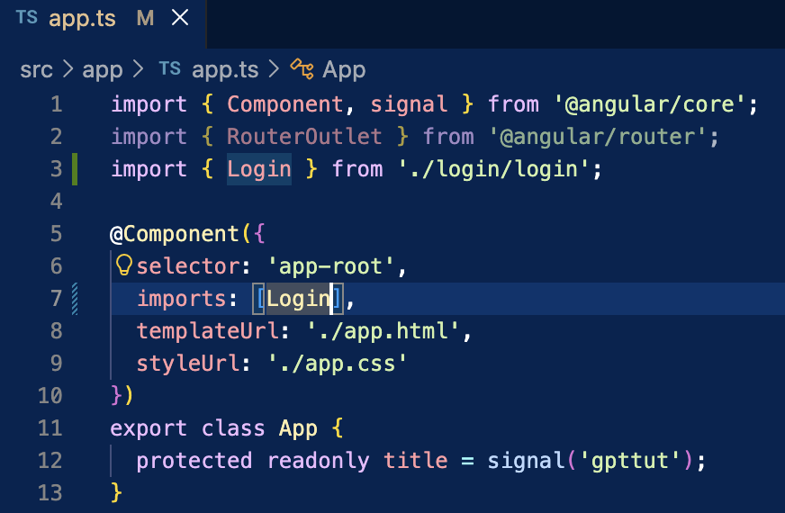

# COMPONENT 

WHAT ?  
Building blocks, reusable things 

Mostly every components has 4 parts
1. .css
2. .html
3. .spec.ts => For testing
4. .ts => For logics

---
### Generate Component :-
`ng generate component <Name>` OR `ng g c test`  
CLI automatically creates `<Name>` component inside app component:
- test.component.html
- test.component.css
- test.component.spec.ts
- test.component.ts

---
Exmple:-

    ng generate component login

To link `login.html` and `app.html`  

1. Go to login.ts
2. Copy the selector name

3. Use that as a tag in app.html

4. Go to `app.ts`, add import of that component
