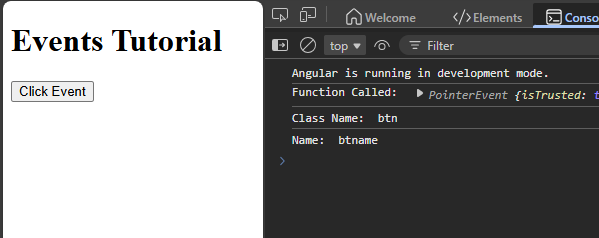
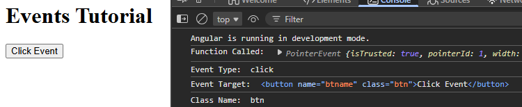
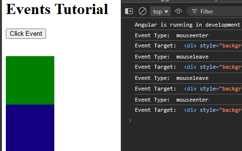
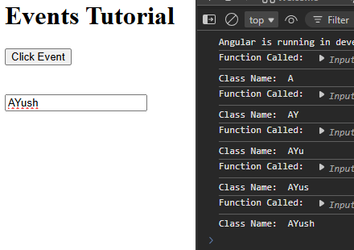

# Events

```html
<!-- app.html -->
<h1>Events Tutorial</h1>

<button class="btn" name="btname" (click)="handleEvent($event)"> Click Event </button>
```
```ts
// app.ts
export class App 
{
  handleEvent(event:any) //any as datatype
  {
    console.log("Function Called: ", event);
    console.log("Class Name: ", event.target.className);
    console.log("Name: ", event.target.name);
  }
}
```



---

### Mouse Event -
```ts
export class App {
  handleEvent(event:MouseEvent){ //MouseEvent as Datatype
    console.log("Function Called: ", event);
    console.log("Event Type: ", event.type);
    console.log("Event Target: ", event.target);
    console.log("Class Name: ", (event.target as Element).className);
  }
}
```



---
```html
<div (mouseenter)="handleEvent($event)"
style="background-color: green; width: 100px; height: 100px;">
</div>
<div (mouseleave)="handleEvent($event)"
style="background-color: rgb(19, 0, 128); width: 100px; height: 100px;">
</div>
```


---

### Input

```html
<input type="text"
(input)="handleEvent($event)">
```
```ts
export class App 
{
  handleEvent(event:Event){
    console.log("Function Called: ", event);
    console.log("Class Name: ", (event.target as HTMLInputElement).value);
  }
}
```
