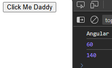

# Signals

A wrapper around a value.  
Gives signal when value changes.

```
count = 10;
count = signal(10)
```

To display .ts signal variable in .html we need ()

```ts
export class App {
  x = 10; //normally
  x2 = signal(50) //using signal
}
```
```html
{{x}}  
{{x2()}} <!--Using ( )-->
```

---

### DataType :-

```ts
export class App 
{
  data = signal<number|string>(10) //defining datatype of signal

// OR

  data: WritableSignal <number|string> = signal(10); // data type for variable

  updateSignal(){
    this.data.set("Hello")  //.set to update values
  }
}
```
---

### Computed Signals -
We cant change them forcefully, gets auto changed when the dependent variable get changed

```ts
export class App {
  x = signal(20)
  y = signal(40)
  z = computed(()=>this.x()+this.y()) //uses callback

  showValue(){
    console.log(this.z())

    this.x.set(100);
    console.log(this.z()) //z will auto get updated as x changed 
  }
}
```


---
We cant change value `this.z.set(10)`, will show error.  