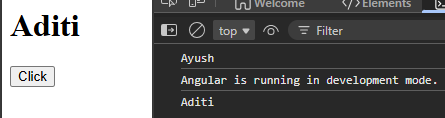

# Effect
Function mostly used inside constructor  
When any signal gets updated, we get a notification in effect


```ts
export class App {
  userName = signal("Ayush")

  constructor(){ //to run effect
    effect( ()=>{
      console.log(this.userName());
    })
  }
}
```

```html
<h1>{{userName()}}</h1>

<button (click)="userName.set('Aditi')" >Click</button>
```




As soon as button is clicked userName is set to Aditi from Ayush

---

