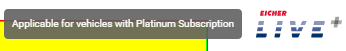

Angular Flex Layout?
It is a library that uses Flexbox (CSS)
👉 But gives you Angular-style syntax


`fxLayout="column"`
is basically:  
`display: flex;`  
`flex-direction: column;`

---

`matTooltipPosition="before"`  
above → top  
below → bottom  
left / before → left side  
right / after → right side



---

What is Angular Material?
👉 Angular Material = a UI library for Angular
It gives you prebuilt components so you don’t build everything from scratch.

You just use ready components:-
```html
<button mat-button>Click</button>
<mat-table></mat-table>
<mat-tab-group></mat-tab-group>

```

---

Tabs =
Different views inside same page
switchable by clicking

    mat-tab-group → container (whole tab section)
    mat-tab → individual tab
    label="..." → name shown in UI
    inside mat-tab → content of that tab

```html
<mat-tab-group>
  <mat-tab label="Tab 1">Content 1</mat-tab>
  <mat-tab label="Tab 2">Content 2</mat-tab>
</mat-tab-group>
```