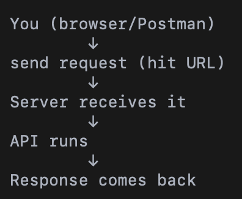

# 
 BASICS
Two machines  
- Client → wants something  
- Server → has something  

They need a way to communicate.  
They need rules: HTTP = fixed rules for communication

---
### REQUEST ?
When client talks, it sends a structured message:  

1. Method (intent)  
GET → give me data  
POST → take this data  
PUT → update  
DELETE → remove

2. URL (address of a specific resource on the server)  
http://localhost:3000/seller

	http → how to talk  
	localhost → which machine (server)  
	3000 → which port (door on that machine)   
    /seller → which resource inside

3. Headers (extra info)
4. Body (actual data, optional)

---
### RESPONSE ?
What server does ?  
Server receives request → checks: 
Method?
URL?
Data?  
Then runs logic & Server response

What response contains ?
1. Actual result
2. Status Code: 200, 404 etc

### STATUS CODE ?
Number that tells result of request

	•	200 → OK (success)
	•	201 → Created
	•	400 → Bad Request
	•	401 → Unauthorized
	•	403 → Forbidden
	•	404 → Not Found
	•	500 → Server Error

---
# 
API ?

A way for one program (client) to ask another program (server) to do something.

#### What makes something an API ?   
- URL (endpoint) → where
- Method (GET/POST) → what action
- Response (data) → result